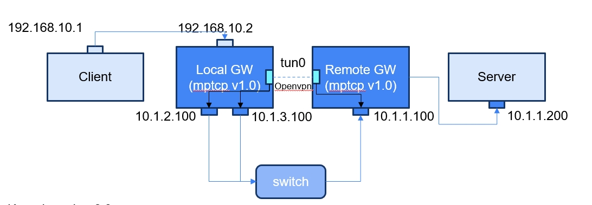

# OpenMAG
Open Mobile Aggregation Gateway

## Prerequisites

Before proceeding with the MPTCP configuration, ensure that:

- **Operating System:** >= Ubuntu 22.04
- **Kernel Version:** 6.8.0-52-generic

We need four machines to set up the testbed:

- Client : at least have a single WAN interface
- Local GW (Gateway) : Local GW **must** have at least two WAN interfaces to set up multipath.
- Remote GW (Gateway) : at least have a single WAN interface
- Server : at better the `apache2` service installed and running, with files available for download under the `/var/www/html/` directory.

**Topology Example:**

Below is a visual representation of the network topology:



## Installation

The Local & Remote GW must install the kernel version with MPTCP v1.0, and OpenVPN >= v2.6.8

### MPTCP v1.0 Kernel Installation

Kernel installation:

1.  Install the generic HWE kernel:

    ```bash
    apt install linux-generic-hwe-22.04
    ```

2.  Edit the GRUB configuration file:

    ```bash
    vim /etc/default/grub
    ```

    Modify the following lines:

    ```
    GRUB_DEFAULT="Advanced options for Ubuntu>Ubuntu, with Linux 6.8.0-52-generic"
    GRUB_TIMEOUT_STYLE=menu
    GRUB_TIMEOUT=5
    GRUB_CMDLINE_LINUX_DEFAULT="quiet splash ipv6.disable=1"
    GRUB_CMDLINE_LINUX="ipv6.disable=1"
    ```

3.  Update GRUB and reboot:

    ```bash
    update-grub
    reboot
    ```

4.  Verify the kernel version:

    ```bash
    uname -r
    ```

    Expected output:

    ```
    6.8.0-52-generic
    ```

### OpenVPN Installation

As kernel 6.8.x has applied openssl 3.x, the openvpn version must be above 2.6.8 to adapt to new openssl. We choose 2.6.10 for example.

1.  Install dependencies:
    ```bash
    apt install easy-rsa libssl-dev liblz4-dev liblzo2-dev libpam0g-dev cmake autoconf libtool libnl-3-dev libnl-genl-3-dev libcap-ng-dev pkg-config
    ```
2.  Download OpenVPN 2.6.10:

    ```bash
    wget https://github.com/OpenVPN/openvpn/releases/download/v2.6.10/openvpn-2.6.10.tar.gz

    tar -xvf openvpn-2.6.10.tar.gz

    cd openvpn-2.6.10
    ```

3.  Compile and install openvpn:

    ```bash
    autoreconf -i -v -f
    ./configure
    make && make install
    ```

## Configuration


## Usage

Examples of how to use the project.
